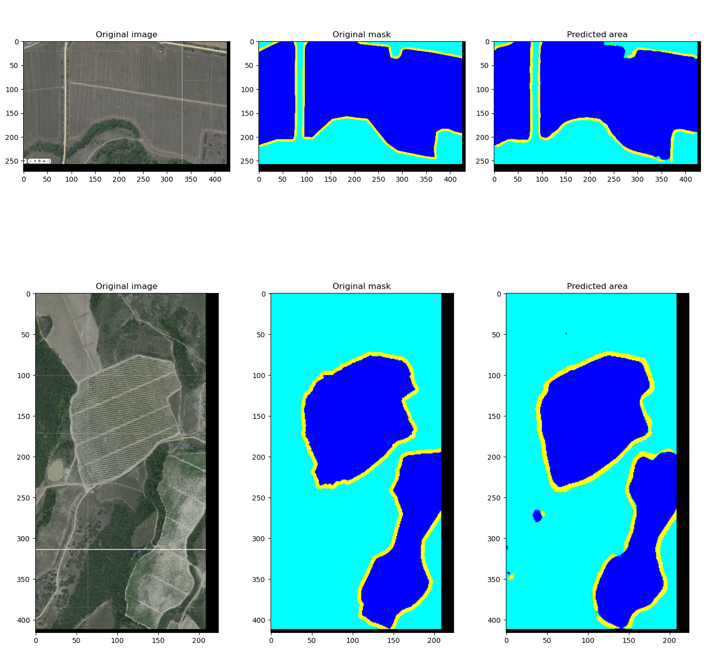

# Image Segmentation for Vineyard Detection using U-Net

[English](#image-segmentation-for-vineyard-detection-using-u-net)

## Project Description

This repository contains the results of my industrial practice project on the topic: **"Determining vineyard contours on satellite images, creating a dataset and a neural network for detecting vineyard contours from RGB images"**.

The goal was to develop a complete pipeline for semantic segmentation of satellite imagery to automatically outline vineyard boundaries. The project includes dataset preparation, implementation and training of a U-Net convolutional neural network, and evaluation of its performance.

### Key Features:
*   **Dataset Preparation:** Manual collection and labeling of 299 image-mask pairs from satellite imagery.
*   **Model Architecture:** Implementation of the U-Net architecture, a proven model for semantic segmentation tasks.
*   **Training Pipeline:** Full training process using TensorFlow/Keras with callbacks for early stopping and learning rate reduction.
*   **Results Analysis:** Examples of both successful and unsuccessful segmentations with conclusions on model performance and dataset limitations.

## Repository Structure

The project has the following structure. The key files are:

```bash
Image-segmentation-using-UNet-2/
├── Unet2024_modified.ipynb      # Main Jupyter Notebook with the complete code
├── Отчёт по практике.pdf        # Detailed project report in Russian
├── Ссылка на набор данных.md    # File with the dataset download link
└── README.md                    # This file
```
## Dataset

The dataset consists of **299 pairs of satellite images and their corresponding masks**.
*   **Images:** RGB satellite images of areas containing vineyards (`*.png` format).
*   **Masks:** Binary masks where the pixels belonging to vineyards are marked in white (`*.png` format).

**Access:** The dataset is available via the link provided in the file `Ссылка на набор данных.md`.

## Technologies Used

*   **Python 3**
*   **TensorFlow 2 / Keras**
*   **NumPy**
*   **Matplotlib**
*   **Jupyter Notebook**

## Model Architecture: U-Net

The project uses a modified **U-Net** architecture, which is well-suited for image segmentation tasks. The key components of the implemented model include:

*   **Encoder (Contracting Path):** A series of convolutional and max-pooling layers to capture the context in the image.
*   **Bottleneck:** A layer that connects the encoder and decoder.
*   **Decoder (Expansive Path):** A series of upsampling and convolutional layers to enable precise localization using transposed convolutions.
*   **Skip Connections:** Connections between layers of the same size in the encoder and decoder to help preserve spatial information.

**Final Layer Activation:** `sigmoid` (for binary segmentation).
**Loss Function:** `binary_crossentropy`.
**Optimizer:** `Nadam` (Nesterov-accelerated Adaptive Moment Estimation).

## Installation and Setup

1.  **Clone the repository:**
    ```bash
    git clone https://github.com/your-username/Image-segmentation-using-UNet-2.git
    cd Image-segmentation-using-UNet-2
    ```

2.  **Download the dataset** from the link in `Ссылка на набор данных.md` and extract the `IMG` (images) and `Mask` (masks) folders into the project directory.

3.  **Install the required dependencies** (it's recommended to use a virtual environment):
    ```bash
    pip install tensorflow numpy matplotlib pandas
    # or create an environment from a potential requirements.txt
    # pip install -r requirements.txt
    ```

## Usage

The main workflow is contained within the Jupyter Notebook `Unet2024_modified.ipynb`.

1.  **Open the notebook:**
    ```bash
    jupyter notebook Unet2024_modified.ipynb
    ```

2.  **Run the cells sequentially:**
    *   The first cells import necessary libraries and define helper functions for loading, resizing, scaling, and padding images.
    *   Subsequent cells create TensorFlow Datasets for training, validation, and testing.
    *   The U-Net model is defined and compiled.
    *   The model is trained with callbacks for `EarlyStopping` and `ReduceLROnPlateau`.
    *   Finally, the results are visualized, showing original images, ground truth masks, and model predictions side by side.

## Results

The model was trained for 45 epochs (early stopping triggered) and achieved a final validation accuracy of **~82.5%** and a validation loss of **~0.06**.

**Examples of Successful Segmentation:**
(The model accurately outlines the vineyard areas)

*Caption: Example of a successful prediction where the model's output closely matches the ground truth mask.*

**Examples of Unsuccessful Segmentation:**
(The model struggles with complex boundaries or small/unclear vineyards)

*Caption: Example where the model fails to capture the exact shape or confuses the vineyard with other features.*

## Conclusions and Outlook

The project successfully achieved its main goal: a functional dataset was created, and a U-Net model was implemented and trained for vineyard segmentation.

*   **Main Limitation:** The size of the dataset (299 images) was identified as the primary factor limiting the model's accuracy and generalization ability. The report concludes that a larger dataset is needed for more robust performance.
*   **Future Improvements:**
    *   Significantly increase the volume and diversity of the training dataset.
    *   Experiment with data augmentation techniques (rotations, flips, brightness adjustments).
    *   Try more modern architectures (e.g., U-Net++, Attention U-Net) or pre-trained encoders (Transfer Learning).
    *   Tune hyperparameters more thoroughly.

## Report

A detailed report on the project (in Russian) is available in the file: `Отчёт по практике.pdf`. It includes the theoretical background on neural networks, a detailed description of the practical implementation, and an analysis of the results.

## Author

**Daniil Kovalev**
*   University: Saint Petersburg State University of Aerospace Instrumentation (SUAI)
*   Direction: Software Engineering (09.03.04)
*   Group: 4133

---
