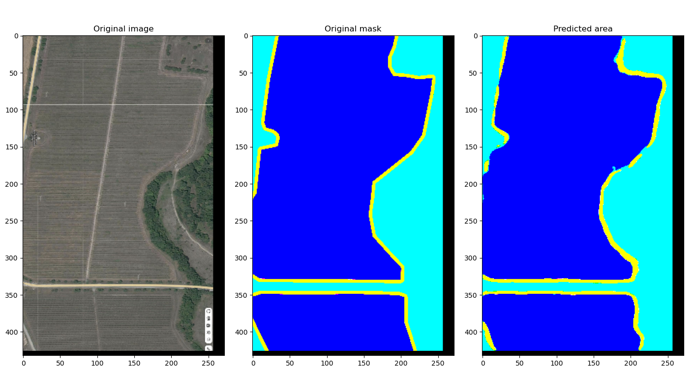

# Сегментация изображений для обнаружения виноградников с помощью U-Net

[Русский](#сегментация-изображений-для-обнаружения-виноградников-с-помощью-u-net)

## Описание проекта

Данный репозиторий содержит результаты работы по производственной практике на тему: **«Определение контуров виноградников на спутниковых снимках, создание набора данных и нейросети для обнаружения контуров виноградников по RGB-изображениям»**.

Целью проекта была разработка полного пайплайна для семантической сегментации спутниковых снимков с целью автоматического определения границ виноградников. Работа включает в себя подготовку датасета, реализацию и обучение сверточной нейронной сети U-Net, а также оценку её эффективности.

### Ключевые особенности:
*   **Подготовка датасета:** Ручной сбор и разметка 299 пар «изображение-маска» на основе спутниковых снимков.
*   **Архитектура модели:** Реализация архитектуры U-Net, proven model для задач семантической сегментации.
*   **Процесс обучения:** Полный цикл обучения с использованием TensorFlow/Keras с колбэками для ранней остановки и уменьшения темпа обучения.
*   **Анализ результатов:** Примеры как успешной, так и неудачной сегментации с выводами о работе модели и ограничениях датасета.

## Структура репозитория

Проект имеет следующую структуру. Ключевые файлы:

```bash
Image-segmentation-using-UNet-2/
├── Unet2024_modified.ipynb      # Основной Jupyter Notebook с полным кодом
├── Отчёт по практике.pdf        # Детальный отчёт по проекту на русском языке
├── Ссылка на набор данных.md    # Файл с ссылкой для скачивания датасета
└── README.md                    # Этот файл
```
## Датасет

Датасет состоит из **299 пар спутниковых изображений и соответствующих им масок**.
*   **Изображения:** RGB-спутниковые снимки территорий, содержащих виноградники (формат `*.png`).
*   **Маски:** Бинарные маски, в которых пиксели, принадлежащие виноградникам, помечены белым цветом (формат `*.png`).

**Доступ:** Датасет доступен по ссылке, указанной в файле `Ссылка на набор данных.md`.

## Используемые технологии

*   **Python 3**
*   **TensorFlow 2 / Keras**
*   **NumPy**
*   **Matplotlib**
*   **Jupyter Notebook**

## Архитектура модели: U-Net

В проекте используется модифицированная архитектура **U-Net**, хорошо подходящая для задач сегментации изображений. Ключевые компоненты реализованной модели включают:

*   **Энкодер (Сжимающий путь):** Последовательность сверточных и пулинговых слоев для захвата контекста изображения.
*   **Центральная часть (Bottleneck):** Слой, соединяющий энкодер и декодер.
*   **Декодер (Расширяющий путь):** Последовательность апсемплинговых и сверточных слоев для точной локализации с использованием транспонированных сверток.
*   **Пропускающие соединения (Skip Connections):** Соединения между слоями одинакового размера в энкодере и декодере, помогающие сохранять пространственную информацию.

**Функция активации на выходном слое:** `sigmoid` (для бинарной сегментации).
**Функция потерь:** `binary_crossentropy`.
**Оптимизатор:** `Nadam` (Nesterov-accelerated Adaptive Moment Estimation).

## Установка и настройка

1.  **Клонируйте репозиторий:**
    ```bash
    git clone https://github.com/your-username/Image-segmentation-using-UNet-2.git
    cd Image-segmentation-using-UNet-2
    ```

2.  **Скачайте датасет** по ссылке из файла `Ссылка на набор данных.md` и распакуйте папки `IMG` (изображения) и `Mask` (маски) в директорию проекта.

3.  **Установите необходимые зависимости** (рекомендуется использовать виртуальное окружение):
    ```bash
    pip install tensorflow numpy matplotlib pandas
    # или создайте окружение из potential requirements.txt
    # pip install -r requirements.txt
    ```

## Использование

Основная рабочая среда содержится в Jupyter Notebook `Unet2024_modified.ipynb`.

1.  **Откройте блокнот:**
    ```bash
    jupyter notebook Unet2024_modified.ipynb
    ```

2.  **Запустите ячейки последовательно:**
    *   Первые ячейки импортируют необходимые библиотеки и определяют вспомогательные функции для загрузки, изменения размера, масштабирования и дополнения изображений.
    *   Последующие ячейки создают TensorFlow Datasets для обучения, валидации и тестирования.
    *   Определяется и компилируется модель U-Net.
    *   Модель обучается с использованием колбэков `EarlyStopping` и `ReduceLROnPlateau`.
    *   В конце визуализируются результаты: исходные изображения, истинные маски и предсказания модели выводятся side-by-side.

## Результаты

Модель была обучена в течение 45 эпох (сработала ранняя остановка) и достигла итоговой точности на валидационном наборе **~82.5%** и значения функции потерь **~0.06**.

**Примеры удачной сегментации:**
(Модель точно outlines границы виноградников)

*Подпись: Пример успешного предсказания, где выход модели близко соответствует исходной маске.*

**Примеры неудачной сегментации:**
(Модель ошибается на сложных границах или мелких/нечетких виноградниках)

*Подпись: Пример, где модель не смогла точно capture форму или спутала виноградник с другими объектами.*

## Выводы и перспективы

Проект успешно достиг основной цели: был создан рабочий датасет, реализована и обучена модель U-Net для сегментации виноградников.

*   **Основное ограничение:** Размер датасета (299 изображений) был определен как основной фактор, ограничивающий точность и способность модели к обобщению. В отчете сделан вывод о необходимости большего объема данных для повышения качества работы.
*   **Возможные улучшения:**
    *   Значительно увеличить объем и разнообразие обучающего датасета.
    *   Поэкспериментировать с методами аугментации данных (повороты, отражения, коррекция яркости).
    *   Опробовать более современные архитектуры (например, U-Net++, Attention U-Net) или предобученные энкодеры (Transfer Learning).
    *   Провести более тщательный подбор гиперпараметров.

## Отчёт

Детальный отчёт по проекту (на русском языке) доступен в файле: `Отчёт по практике.pdf`. Он включает теоретические основы нейронных сетей, подробное описание практической реализации и анализ результатов.

## Автор

**Ковалев Даниил Владимирович**
*   ВУЗ: Санкт-Петербургский государственный университет аэрокосмического приборостроения (ГУАП)
*   Направление: Программная инженерия (09.03.04)
*   Группа: 4133
